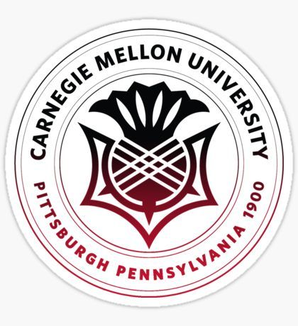
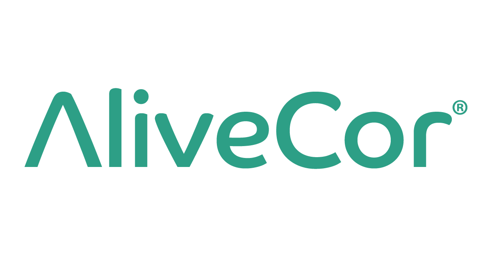

### My academic and professional experience

 **Academic experience:** 

**Graduate:** Columbia University Mailman School of Public Health, Class of 2023, Major: Biostatistics, Pharmaceutical Statistics, Public Health Data Science (full-time)

**Undergraduate:** Carnegie Mellon University, Class of 2021, Major: Artificial Intelligence

 **Professional experience and projects:** 

**Data Scientist, AliveCor (part-time)**, Aug 2020-present  
Working on the AI and Data Science team to perform data analytics on and develop new models revolving around ECG data. Develop new algorithms to cluster ECG embeddings in meaningful ways and detect new conditions. Perform data mining tasks and exploration of new project areas.

  

**Research Collaboration, Mass Gen Hospital, Harvard Medical School**, June 2020-present	
COVID-19 Simulator: covid19sim.org. Health economic modeling and data analysis. Led analysis for spread of COVID-19 cases on college campuses. Published in STAT News: https://www.statnews.com/2020/10/27/reopen-colleges-universities-safely-spring-2021/

  

**Computational Researcher, Computational Biology Dept., CMU.**, June-Aug 2020  
Training SVMs to find cell type specific sequences for retinal cells to develop targeted gene therapy techniques. Understand which retinal cell types contribute to retinal conditions and design sequences that correlate most  with certain mutations.

   

**Software Development Engineer Intern, Amazon**, Summer 2020, Summer 2019  
(2020) Feature development of new rating and review engine for AWS Console iOS mobile application for on-the-go monitoring.  
(2019) Developed internal tool using AWS services for Automated Profitability Management to help automate the generation of best suggested price for vendors to sell at on Amazon. 

